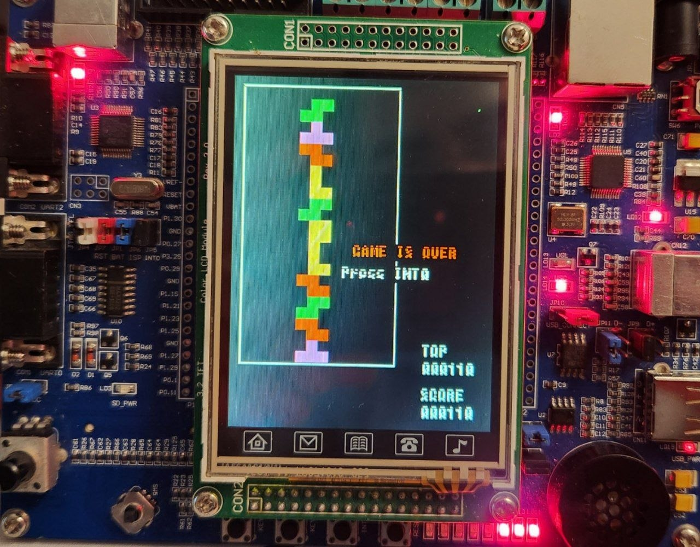

# 🎮 Tetris on LPC1768 — Bare-Metal Embedded C



A fully-featured Tetris game running on the **NXP LPC1768 ARM Cortex-M3** microcontroller (LandTiger board), written entirely in bare-metal C with no RTOS. Developed as an extra-credit project for the **Computer Architecture** course at **Politecnico di Torino**.

---

## 🔧 Hardware Platform

| Component | Details |
|-----------|---------|
| MCU | NXP LPC1768 (ARM Cortex-M3 @ 100 MHz) |
| Board | LandTiger LPC1768 |
| IDE | Keil uVision 5 |
| Display | 240×320 GLCD (pixel-level rendering) |
| Input | 5-way joystick + 2 external interrupt buttons |
| Speed control | On-board potentiometer → ADC |
| Sound | DAC output (timer-driven waveforms) |

---

## ⚡ Peripherals Used

- 🖥️ **GLCD** — pixel-level block and border rendering
- 🕹️ **Joystick (GPIO + RIT)** — left / right / rotate / soft drop with debouncing via Repetitive Interrupt Timer
- 🔘 **EINT0** — Start / Pause / Resume / Restart
- 🔘 **EINT1** — Hard drop
- 🎚️ **ADC** — Potentiometer maps 0–4095 → speed level 1–5
- 🔊 **DAC** — Sound effects (line clear, Tetris, game over, powerup)
- ⏱️ **Timer 3** — 10 ms game tick interrupt
- ⏱️ **Timer 0** — Sound waveform generation

---

## 🕹️ Game Features

### Core Mechanics
- All 7 standard tetrominoes (I, O, T, S, Z, J, L) with distinct colors 🟦🟨🟪🟩🟥🔵🟠
- Rotation, horizontal movement, soft drop and instant hard drop
- Collision detection against walls and placed blocks
- 14×25 playfield

### 🏆 Scoring
| Event | Points |
|-------|--------|
| Piece placed | +10 |
| 1–3 lines cleared | +100 per line |
| Tetris (4 lines) | +600 |
| Clear Half powerup | +100 per cleared line (up to +600 for groups of 4) |

### ⚡ Speed System
The fall speed is read continuously from the ADC (potentiometer):

| ADC Range | Speed Level | Fall Interval |
|-----------|-------------|---------------|
| 0–819 | 1 | 1000 ms |
| 820–1638 | 2 | 500 ms |
| 1639–2457 | 3 | 333 ms |
| 2458–3276 | 4 | 250 ms |
| 3277–4095 | 5 | 200 ms |

Soft drop (joystick down) doubles the current fall speed.

### ⭐ Powerup System
Every **5 lines cleared**, a hidden powerup block is embedded in the field. Clearing the line containing it triggers one of two effects:

| Powerup | Effect |
|---------|--------|
| 💥 Clear Half | Removes the bottom half of all occupied rows |
| 🐢 Slow Down | Forces speed to level 1 for 15 seconds |

### ☠️ Malus System
Every **10 lines cleared**, a partially-filled garbage row (7 random blocks) is pushed up from the bottom, raising the stakes as the game progresses.

### Other
- ⏸️ Pause / resume mid-game (EINT0 toggle)
- 💀 Game Over screen with high score tracking and one-button restart
- 🔊 Sound effects on line clear, Tetris, powerup activation, and game over

---

## 📁 Project Structure

```
extrapoint2_tetris/
├── Main.h                  # Game constants, structs, and all prototypes
├── Source/
│   ├── sample.c            # Main game logic (spawn, collision, movement, scoring)
│   ├── timer/              # Timer init + IRQ (game tick & sound)
│   ├── RIT/                # Repetitive Interrupt Timer (joystick polling)
│   ├── button_EXINT/       # External interrupt handlers (start, hard drop)
│   ├── joystick/           # Joystick GPIO init
│   ├── ADC/                # ADC init + IRQ (speed mapping)
│   ├── DAC/                # DAC init + sound output
│   ├── GLCD/               # LCD driver (pixel, text, tetromino rendering)
│   ├── led/                # LED driver
│   └── CMSIS_core/         # ARM CMSIS headers
└── sample.uvprojx          # Keil uVision project file
```

---

## 🎮 Controls

| Input | Action |
|-------|--------|
| ⬅️ Joystick Left | Move piece left |
| ➡️ Joystick Right | Move piece right |
| ⬆️ Joystick Up | Rotate piece clockwise |
| ⬇️ Joystick Down | Soft drop (2× speed) |
| 🔘 KEY1 (EINT0) | Start / Pause / Resume / Restart |
| 🔘 KEY2 (EINT1) | Hard drop |
| 🎚️ Potentiometer | Fall speed (1–5) |

---

## 🛠️ Build & Flash

1. Open `sample.uvprojx` in **Keil uVision 5**
2. Select the **LandTiger LPC1768** target
3. Build (`F7`)
4. Flash via J-Link or the on-board programmer (`F8`)

---

## 👤 Author

**Milad** — Computer Architecture, Politecnico di Torino, Semester 1
